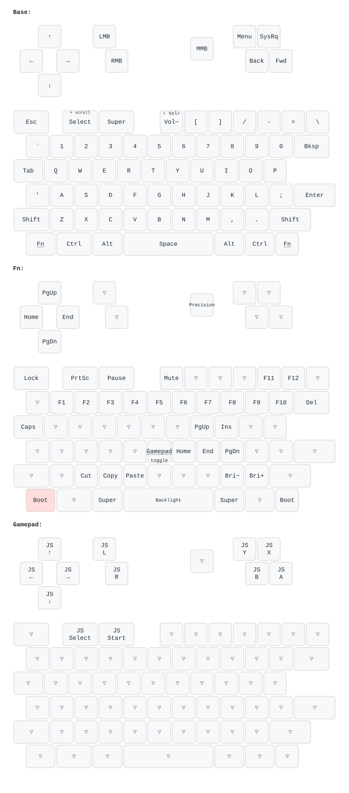

# uConsole QMK Keyboard Firmware

This repository provides a streamlined, standalone QMK firmware distribution specifically optimized for the **ClockworkPi uConsole**.

Unlike the standard QMK repository, this project isolates the uConsole keyboard logic. By removing unrelated drivers and keyboard definitions, provide a lightweight environment dedicated to perfecting the uConsole typing experience.

## 🎯 Project Goals

* **Clean Workspace:** Only contains code relevant to the uConsole keyboard.
* **Minimal Context:** Makes it easy to identify specific hardware changes and logic.
* **Rapid Development:** Faster compile times and easier testing of experimental QMK features.
* **Streamlined CI/CD:** Simple workflows for rebuilding and releasing binaries.
* **Low Barrier to Entry:** Easier for community members to contribute layouts without learning the entire QMK ecosystem.

## 🧪 Keyboard Tester

Test your uConsole keyboard layout and functionality with our interactive keyboard tester:

**[https://j1n6.github.io/qmk-uconsole/](https://j1n6.github.io/qmk-uconsole/)**

This web-based tool provides:
* **Visual Feedback:** See which keys are being pressed in real-time
* **Layer Detection:** Shows Fn layer key combinations
* **D-Pad & Gamepad Testing:** Test arrow keys, joystick buttons (X, Y, A, B), and mouse buttons (L, R, Middle)
* **Scroll & Cursor Tracking:** Visualize trackball movement and scroll events

Perfect for verifying your firmware installation and familiarizing yourself with the uConsole's unique keyboard layout!

## 🎹 Keymap

> [!IMPORTANT]
> **Keyboard Locale / OS Layout:** This firmware expects the host operating system's keyboard layout to be set to **US English (ANSI)**. If your OS is configured with a different layout, some key outputs—specifically special characters—might not display correctly or map to different symbols.



Hold **Fn** for the Fn layer. ▽ keys fall through to the layer below. Layer 3
is empty and free to configure in VIA.

### Special keys and combos

| Keys | Action |
|---|---|
| **`Fn` + `G`** | Gamepad mode on/off (layer 2): the D-pad drives the joystick axes; A/B/X/Y, Select/Start and L/R are joystick buttons 0-7 |
| **Hold `Select` or `Fn` + move trackball** | Scroll: up/down vertical, left/right horizontal. Select (`SEL_SCRL`) still sends Select |
| **`Fn` + trackball click** | Precision cursor mode on/off (`TB_PREC`) |
| **`Shift` + `Vol−`** | Volume up |
| **`Fn` + `Space`** | Next backlight level |
| **`Fn` + `Esc`** | Lock (`KB_LOCK`): keys and trackball are ignored, backlight off, Sleep is sent. Press again to unlock (sends Wake); while locked only `Fn` and `Fn` + `Esc` work |
| **`Fn` + `Fn`** | Reboot into the bootloader for flashing |

### Layer indicator (waybar)

The firmware prints the active layer (`uconsole:layer N`) on the QMK console on
every layer change and every 5 s. The console is a separate HID interface, so
this doesn't interfere with VIA. [`tools/uconsole-layer`](tools/uconsole-layer)
follows it and prints JSON for a waybar custom module; the base layer gives an
empty text, so the module is only visible while another layer is active:

```json
"custom/keyboard-layer": {
    "exec": "/path/to/qmk-uconsole/tools/uconsole-layer",
    "return-type": "json",
    "restart-interval": 5
}
```

Each layer also sets a CSS class (`base`, `fn`, `gamepad`, `free`, or
`disconnected` while the keyboard is missing), e.g.
`#custom-keyboard-layer.gamepad { color: #8ec07c; }`. Layer names can be passed
as arguments: `uconsole-layer Base Fn Game Free`. The script needs the same
`/dev/hidraw` access as `uconsole-backlight` (see the udev rule below).

### Backlight
`Fn` + `Space` cycles the backlight through 10 brightness levels and off.
The **Backlight** tab in VIA configures:
* **Brightness**.
* **Idle dimming** (on by default): the backlight fades out after 5 s without
  key presses or trackball movement and fades back in on activity. Timeout,
  fade-out and fade-in times are adjustable; timeout 0 turns it off.
* **Key press boost**: briefly brightens the backlight on every key press
  (off by default), with adjustable strength and fade-out time.

Both effects work on the same brightness, so switching between them is smooth.

From the system, [`tools/uconsole-backlight`](tools/uconsole-backlight) reads or
sets the level over the VIA protocol (`uconsole-backlight 3`; no argument prints
the current level). It needs access to the keyboard's `/dev/hidraw` node: run it
as root or add a udev rule:
```
KERNEL=="hidraw*", ATTRS{idVendor}=="434b", ATTRS{idProduct}=="5543", MODE="0660", TAG+="uaccess"
```

### VIA
The firmware supports [VIA](https://usevia.app) with 4 layers: layers 0-2 are
the defaults described above, layer 3 is empty and free to configure.
VIA also offers layer keys for layers 4-9; the firmware ignores them. The
keyboard is not in the VIA repository, so load its definition manually: in
VIA open **Settings**, enable **Show Design tab**, then in **Design** load
[`clockworkpi/uconsole/via.json`](clockworkpi/uconsole/via.json). The
joystick axes, gamepad buttons, lock, precision mode, scroll (trackball
scrolls while held) and select + scroll keycodes are available under **Custom**.

Trackball settings live in the **Trackball** tab of VIA: cursor speed,
acceleration, precision mode speed, glide strength (how long the cursor keeps
coasting after the ball stops, 0 = off), scroll speed
and direction, and for each layer whether the ball moves the cursor or scrolls
(by default it scrolls while `Fn` holds layer 1). Changes apply immediately and
are saved to EEPROM.

Keymaps and macros edited in VIA are stored in EEPROM. Flashing a firmware
built on a different date, or one with a changed default keymap or settings
layout, resets them (and the trackball and backlight settings) to the defaults
compiled into it.

## 🎯 Flashing

> [!WARNING]
> Keep another input method (external keyboard or SSH) at hand: if flashing
> fails, the uConsole keyboard won't work until it is reflashed. The rest of
> the unit is unaffected.

The keyboard uses the stm32duino bootloader (`1eaf:0003`). After every reset it
waits 2-3 seconds for an upload, then starts the installed firmware.

**Prepare.** Install `dfu-util` (`sudo apt install -y dfu-util`) and get
`clockworkpi_uconsole_default.bin` from
[Releases](https://github.com/j1n6/qmk-uconsole/releases) or
build it (see *Building in a Container* below).

### Update existing QMK firmware

```sh
sudo dfu-util -w -d 1eaf:0003 -a 2 -D clockworkpi_uconsole_default.bin -R
```

When it prints `waiting for device`, press **Fn+Fn** (hold one Fn, press the
other) to reboot the keyboard into the bootloader. `make reflash` builds the
firmware in the container and then runs the same command. Any key assigned `QK_BOOT` in VIA works the same way.

### First flash from the stock ClockworkPi firmware

```sh
wget https://github.com/clockworkpi/uConsole/raw/master/Bin/uconsole_keyboard_flash.tar.gz
tar zxvf uconsole_keyboard_flash.tar.gz && cd uconsole_keyboard_flash
# in maple_upload change every delay from 750 to 1500 ms (avoids "serial port not ready")
sudo ./maple_upload ttyACM0 2 1EAF:0003 /path/to/clockworkpi_uconsole_default.bin
```

On musl systems (Alpine, postmarketOS) install `gcompat` first.

### 🆘 Recovery

If the keyboard doesn't respond after flashing, first reboot the OS and retry.
If that doesn't help, force the bootloader in hardware:

1. Connect the keyboard to the uConsole with a micro-USB cable.
2. Short the **S1** pads on the keyboard PCB; the green LED flashes.
3. In `uconsole_keyboard_flash` run `sudo ./flash` to restore the stock
   firmware (it may take several attempts), then flash QMK again.


## 🛠️ Building in a Container (podman compose)

`compose.yaml` provides two services; the repository is mounted into the containers, so results land in your checkout and are owned by your user.

* **`build`** — compiles the firmware with the QMK toolchain (fetches the `qmk_firmware` submodule on first run):
  ```sh
  podman compose run --rm build              # default keymap
  podman compose run --rm build default      # a single keymap
  ```
  Produces `clockworkpi_uconsole_default.bin` in the repository root.

* **`claude`** — an interactive [Claude Code](https://code.claude.com) session with the same toolchain, so the agent can build the firmware itself:
  ```sh
  podman compose run --rm claude
  podman compose run --rm claude --resume    # extra arguments go to `claude`
  ```
  Log in on first start, or export `ANTHROPIC_API_KEY` beforehand. Login and history are kept in the `claude-home` volume.

Rebuild the images with `podman compose build` to update the toolchain or Claude Code. Requires `podman-compose` (the services use `userns_mode: keep-id`).

The `Makefile` wraps the common tasks: `make` builds the firmware in the container,
`make local` builds it with a QMK toolchain installed on the host, `make reflash`
builds and flashes it, and `make layout` redraws the keymap picture.

### Keymap picture

`images/layout.svg` is drawn by
[keymap-drawer](https://github.com/caksoylar/keymap-drawer) from:

* `clockworkpi/uconsole/keymaps/default/keymap.json` - the default keymap;
* `clockworkpi/uconsole/keyboard.json` - physical key positions and sizes;
* `clockworkpi/uconsole/keymap-drawer.yaml` - legends for custom keycodes
  (`JS_*`, `TB_*`, `SEL_SCRL`, ...) and other keys.

After changing any of them, redraw the picture and commit it together with the
change:

```sh
podman compose build build   # once: the build image includes keymap-drawer
make layout                  # writes images/layout.svg
```

`make layout` runs `make images/layout.svg` in the build container. With
keymap-drawer installed locally (`pip install keymap-drawer==0.23.0`) you can run
`make images/layout.svg` directly. Layer names and the drawn layers (Base, Fn,
Gamepad; the empty layer 3 is skipped) are set in the `images/layout.svg` rule
of the `Makefile`.

## Other Resources

### Improving Keypress & Backlight
A custom keyboard diffuser design is available to improve the keypress responsiveness & lighting, details can be [found here](https://jing.io/projects/uconsole-keyboard-diffuser/). Most importantly, you are able to fast type on the small keyboard!


### Improving Fit and Reducing Noise
If the trackball does not sit flush beneath the **uConsole** cover or exhibits slight mechanical "play," you can install a custom shim to tighten the fit. This modification eliminates internal gaps and significantly dampens the vibration noise generated when rolling the trackball against the metal chassis.
* **Download:** **[Trackball Shim STL](https://github.com/j1n6/qmk-uconsole/blob/main/images/TPU_Trackball_Shim.stl)**

* **Material Recommendation:** I highly recommend printing this part using **TPU** or another flexible filament. The elasticity of TPU provides the necessary grip to hold the module in place while acting as a shock absorber for a quieter user experience.


## ☕ Support My Work
If you like my work, please consider [Buy me a Coffee](https://buy.stripe.com/00wfZi01WbPn14taZLeZ200). Thank you.
 
 
## 📜 License

This project is licensed under the **GNU General Public License v3.0 (GPL-3.0)**.

You are free to use, modify, and distribute this software under the terms of the GPL-3.0 license. Any derivative works must also be distributed under the same license terms.

For the full license text, see the [LICENSE](LICENSE) file in this repository or visit [https://www.gnu.org/licenses/gpl-3.0.html](https://www.gnu.org/licenses/gpl-3.0.html).

**Note:** This firmware is provided "as is" without warranty of any kind. Use at your own risk.


#### 🤝 Acknowledgments
Special thanks to **[oesmith](https://github.com/oesmith/qmk_firmware)** for the initial groundwork and porting the base layout to the uConsole hardware.

